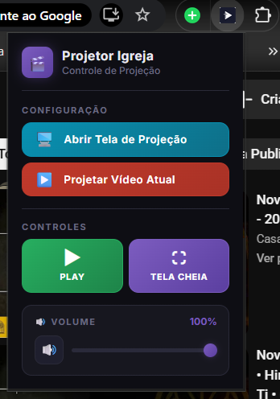

# Projetor Igreja (v2.0)

  

Uma extensão para navegadores baseados em Chromium (Google Chrome, Edge, Brave) desenvolvida especificamente para facilitar e profissionalizar a projeção de vídeos do YouTube em igrejas, cultos e eventos. Ela limpa toda a interface do YouTube, removendo distrações, e oferece um painel de controle remoto avançado diretamente pelo menu da extensão.

## 🚀 Recursos Principais

- **Limpeza de Interface Automática:** Oculta completamente barra de pesquisa, comentários, vídeos sugeridos, chat ao vivo e o título do vídeo, deixando apenas o conteúdo visual em destaque.
- **Ajuste Automático:** Força o player do YouTube para o modo cinema/teatro e maximiza o vídeo.
- **Painel de Controle Remoto via Popup:** 
  - Controle unificado de **Play/Pause**, sincronizado em tempo real.
  - Função de **Stop** real (interrompe, escurece a tela e reinicia o tempo).
  - Alternância de **Tela Cheia** com apenas um clique.
  - **Barra de Progresso e Título (NOVO):** Acompanhe o título do vídeo atual, e o progresso do tempo (minutos e segundos) direto do popup sem precisar olhar para o telão.
  - Controle de Volume integrado com botão rápido de Mudo (Mute).
- **Menu de Preferências (NOVO):** Personalize sua extensão ativando/desativando botões para limpar o painel. Você também pode definir se a janela abre em Tela Cheia por padrão, e em qual monitor ela deve abrir.
- **Segurança Antifalhas:** O botão "Fechar Telão" exige clique duplo para confirmação, evitando que a projeção seja desligada acidentalmente no meio do culto.
- **Modo Blackout de Segurança (Pós-Culto):** Quando o vídeo termina, a tela escurece (blackout total) automaticamente e o autoplay nativo do YouTube é bloqueado, evitando que outro vídeo inicie de surpresa.
- **Gerenciamento Inteligente de Abas:** Botão para abrir uma tela de projeção exclusiva e enviar os vídeos para ela em tempo real. Possui detecção aprimorada e notificações amigáveis diretamente na interface.

## 📦 Como Instalar a Extensão

Como a extensão será instalada de forma local, siga o passo a passo seguro abaixo:

1. **Baixe os arquivos:** Faça o download do código-fonte ou clone este repositório no seu computador e extraia os arquivos para uma pasta segura de sua escolha.
2. **Acesse as Extensões:** Abra o seu navegador Chrome, Edge ou Brave, digite na barra de endereços `chrome://extensions/` (ou `edge://extensions/`) e pressione **Enter**.
3. **Modo do Desenvolvedor:** No canto superior direito da tela de extensões, ative a chave ou botão chamado **"Modo do desenvolvedor"** (Developer mode).
4. **Carregar a Extensão:** Clique no botão **"Carregar sem compactação"** (Load unpacked) que aparecerá no canto superior esquerdo.
5. **Selecione a Pasta:** Navegue até a pasta onde você salvou ou extraiu os arquivos da extensão (a pasta que contém o arquivo `manifest.json`) e selecione-a.
6. **Tudo pronto!** A extensão **Projetor Igreja** aparecerá na sua lista. Para facilitar o uso, clique no ícone de "quebra-cabeça" 🧩 na barra superior do navegador e **fixe (pin)** o ícone da extensão para que ele fique sempre visível.

## 💻 Como Usar

1. Clique no ícone da extensão na sua barra superior.
2. Clique no botão **"Abrir Telão"**. Isso abrirá uma janela limpa, que você pode arrastar para o seu segundo monitor (telão).
3. Na sua janela principal, navegue normalmente pelo YouTube e encontre o vídeo desejado.
4. Abra o vídeo, clique no ícone da extensão novamente e escolha **"Projetar Vídeo Atual"**.
5. O vídeo será automaticamente enviado e aberto na janela do projetor. 
6. Use os controles de Play, Pause, Stop, Tela Cheia, Volume e a nova Barra de Progresso no popup da extensão para manipular o vídeo remotamente, sem precisar clicar no telão.
7. **(Dica)** Você pode clicar no ícone de "Engrenagem" ⚙️ para abrir as Preferências e ocultar botões que não utilize muito, deixando a interface mais minimalista!

## 📄 Licença

Este projeto é de código aberto e está sob a licença [MIT](LICENSE). Sinta-se à vontade para usar, modificar e distribuir o código conforme necessário em sua congregação.