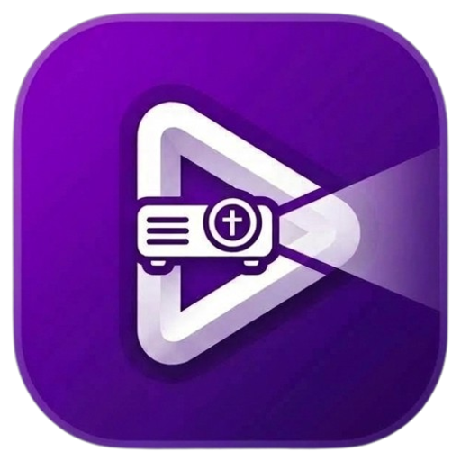
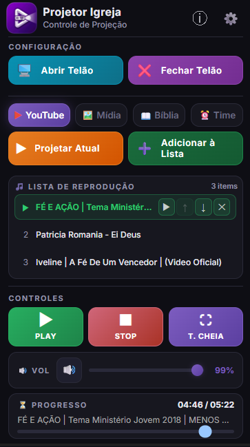
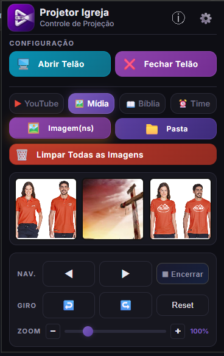
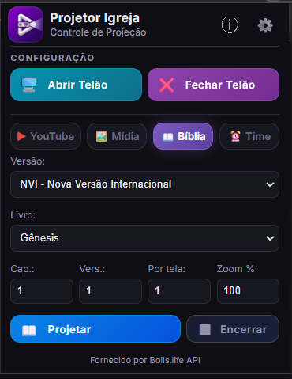
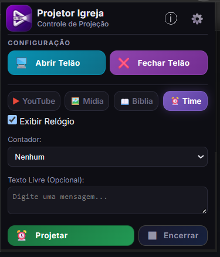

# Projetor Igreja

  
    
  

    
    
    
    
  

  <table>
    <tr>
      <td align="center"> <b>YouTube</b></td>
      <td align="center"> <b>Mídia</b></td>
      <td align="center"> <b>Bíblia</b></td>
      <td align="center"> <b>Time</b></td>
    </tr>
  </table>

Uma extensão para navegadores baseados em Chromium (Google Chrome, Edge, Brave) desenvolvida especificamente para facilitar e profissionalizar a projeção multimídia em igrejas, cultos e eventos. Com um **sistema modular**, ela permite gerenciar de um só lugar projeções de vídeos do YouTube, leitura de versículos bíblicos e exibição de imagens locais, tudo com um painel de controle remoto avançado e uma saída de vídeo extremamente limpa.

## 🧩 Módulos do Sistema

### 🔴 Módulo YouTube
- **Limpeza Visual Absoluta no Telão:** Oculta completamente barra de pesquisa, comentários, vídeos sugeridos, chat ao vivo, título do vídeo, sugestões de fim de vídeo (Endscreens) e cards interativos. A tela de projeção se mantém 100% limpa, exibindo apenas o conteúdo do vídeo e a tela preta no final.
- **🛡️ Bloqueio e Aceleração Silenciosa de Anúncios:** Sistema automático que intercepta propagandas na tela de projeção. O áudio do anúncio é silenciado preventivamente, a reprodução é acelerada para 16x ou avançada imediatamente para o final, e botões de pular ("Pular Anúncio") são clicados no mesmo instante em que surgem, evitando constrangimentos sonoros ou visuais durante o culto.
- **📊 Contador e Histórico de Anúncios Pulados:** Identifica com precisão cada anúncio individual interceptado na tela de projeção (mesmo em blocos de anúncios duplos do YouTube, como "1 de 2" e "2 de 2"). O sistema registra os eventos e permite acompanhar a contagem ao vivo na aba Sobre.
- **🔇 Mudo e Pausa Automáticos na Tela Principal:** Quando ativado nas preferências, silencia e pausa imediatamente qualquer vídeo reproduzido na aba do operador (tela principal) enquanto o telão estiver em uso. A interceptação é contínua e inteligente, barrando até reproduções automáticas acidentais geradas por ações nativas do YouTube (como redimensionar a tela).
- **🔊 Reset Inteligente de Volume:** O nível de volume do player na aba de projeção preserva a sua configuração durante o uso ativo, mas retorna automaticamente ao padrão de 100% caso o navegador seja completamente fechado e reaberto, garantindo previsibilidade no próximo culto.
- **Controle Remoto Sincronizado em Tempo Real:** Play/Pause, Stop (escurece a tela e reinicia o tempo), Tela Cheia e Controle de Volume (com botão Mute) atualizados em tempo real via sincronização reativa, sem necessidade de reabrir o popup.
- **Acompanhamento de Status:** Barra de progresso visível no popup mostrando o tempo decorrido e o título do vídeo atual.
- **Modo Blackout (Pós-Culto):** Quando o vídeo termina, a tela escurece e bloqueia o autoplay nativo do YouTube, evitando vídeos surpresas.
- **Bloqueio Automático de Legendas e Autoplay:** Desativação contínua e universal de legendas sobrepostas e do autoplay do YouTube na janela de projeção, compatível com Chrome e Microsoft Edge.
- **🔊 Transição Suave de Áudio (Fade In / Fade Out):** Ao pausar (Pause) ou parar (Stop) o vídeo, o volume diminui gradativamente em uma fração de segundo (~800ms) antes da interrupção, eliminando cortes secos. Ao retomar o Play (despausar), o áudio realiza uma entrada suave (Fade In) subindo gradualmente até o volume configurado, garantindo uma experiência sonora agradável e profissional no ambiente da igreja sem sustos ou picos acústicos.
- **🆕 Lista de Reprodução Inteligente:** Monte uma fila de vídeos do YouTube diretamente no popup. Ao terminar um vídeo, a extensão avança automaticamente para o próximo da lista — na ordem correta — mesmo com o popup fechado. A fila é preservada durante toda a sessão (mesmo se o telão for fechado acidentalmente) e pode ser reordenada ou limpa a qualquer momento.

### 🖼️ Módulo Mídia (Imagens)
- **Seleção Flexível:** Carregue arquivos de imagem individuais ou selecione uma pasta inteira de uma vez.
- **Galeria Interativa:** Visualize miniaturas das mídias carregadas com destaque na imagem que está sendo projetada.
- **Manipulação Ao Vivo:** Ajuste o zoom para adequar à tela e rotacione as imagens em 90 graus (ideal para fotos de celular).
- **Transição Suave:** Encerre a apresentação de mídia a qualquer momento com um clique, aplicando um "fade out" escuro na tela.

### 📖 Módulo Bíblia
- **Projeção de Versículos:** Escolha versão (NVI, ARA, ACF, etc), Livro, Capítulo e os versículos desejados, que são buscados rapidamente via API.
- **Paginação:** Agrupe múltiplos versículos por tela (ex: 3 versículos por vez) e passe os "slides" facilmente pelos botões de Anterior/Próximo.
- **Ajustes Rápidos:** Possibilidade de ajustar o Zoom rapidamente de dentro do próprio painel para melhorar a legibilidade no telão.

### ⏰ Módulo Time
- **Contagem Regressiva e Progressiva:** Configure facilmente um timer (regressivo) ou cronômetro (progressivo) para auxiliar pregadores, palestrantes ou ministérios no palco.
- **Relógio de Palco Visível:** Mantenha um relógio digital em tempo real discreto ou em destaque na tela.
- **Mensagens Livres:** Adicione recados curtos ou avisos na tela de projeção em conjunto com os contadores.
- **Controle Preciso:** Envie a configuração para a tela e dispare a contagem no momento exato (com opções de Iniciar, Pausar e Zerar), acompanhando tudo por um display de feedback dentro da própria extensão.

## 🚀 Recursos Principais
- **🎨 Nova Identidade Visual:** O novo design apresenta um fundo roxo vibrante em gradiente com elementos em branco e detalhes tridimensionais, unindo um símbolo de play, a projeção de luz e a presença marcante da cruz no projetor. O contraste aprimorado melhora a visibilidade na barra do navegador tanto em temas claros quanto escuros, padronizando a identidade visual da aplicação.
- **🎨 Sistema Completo de Temas:** A interface suporta os modos Claro, Escuro e Automático (baseado no sistema operacional), oferecendo conforto visual perfeito seja em ambientes muito iluminados ou escuros.
- **Gerenciamento Inteligente de Telão:** Botão para abrir o telão em uma janela limpa, com detecção automática do monitor secundário e opção de iniciar já em Fullscreen. A extensão **impede a abertura de múltiplos telões** se o telão já estiver aberto, ela exibe um aviso e coloca a janela existente em foco.
- **Layout Adaptativo:** A interface do popup se ajusta automaticamente com base nos recursos habilitados nas preferências. Quando muitos itens estão visíveis ao mesmo tempo, um modo compacto é ativado para evitar barras de rolagem desnecessárias.
- **Menu de Preferências Centralizado:** Personalize a extensão profundamente através da tela de configurações, dividida por módulos:
  - **Geral:** Escolha o tema da interface (Auto, Claro, Escuro), o monitor alvo (automático ou manual), defina a frequência de busca de atualizações (3 a 30 dias), opte por abrir em Tela Cheia, exibir ou ocultar o botão de fechar e configure a resolução padrão.
  - **YouTube:** Ative ou desative itens da interface de controle (Botão Parar, Tela Cheia, Controles de Volume, Barra de Progresso, Lista de Reprodução) e as funções de proteção da aba principal (Mudo Automático e Pausar Automaticamente).
  - **Bíblia:** Defina a cor padrão do texto e o nível de zoom inicial.
  - **Mídia:** Ative a memorização das imagens importadas para não perdê-las ao fechar o navegador.
  - **Time:** Configure a cor do texto, o tamanho da fonte e o alinhamento da tela de cronômetro/relógio.
- **Armazenamento Seguro:** As imagens carregadas na mídia ficam salvas no armazenamento local, permitindo carregar várias imagens em alta resolução sem perda de dados entre sessões.
- **📊 Contador de Anúncios da Sessão e Relatório:** Quer saber quantas propagandas foram evitadas durante o culto? Clique no ícone de informação (**ℹ️**) no topo da extensão (aba **Sobre**) para visualizar o item *"Anúncios pulados nesta sessão: X"*, que rastreia individualmente cada anúncio pulado no telão (incluindo sequências de "1 de 2" e "2 de 2"). Clicando sobre o número exibido, a extensão gera e baixa automaticamente um relatório em texto (`.txt`) com a data, horário e histórico de cada interceptação. O contador é limpo automaticamente ao fechar o telão.
- **🔔 Notificação Inteligente de Atualização:** O sistema de atualização funciona em duas camadas complementares:
  - **Toast na página:** Quando o agendamento detecta uma nova versão, um aviso flutuante e elegante aparece diretamente na página que você está navegando (ex: YouTube), compatível com o tema Claro e Escuro do sistema.
  - **Badge no Popup:** A cada vez que a extensão é aberta, o sistema compara a versão instalada com a versão remota já salva localmente. Se houver atualização, uma **bolinha vermelha pulsante** aparece sobre o ícone de informações (ℹ️) e o aviso com o botão "Ver Detalhes" já é exibido automaticamente na aba **Sobre**, sem precisar clicar em "Verificar". Ao atualizar a extensão, o badge desaparece automaticamente.
  - **Histórico de Lançamento na Aba Sobre:** Você pode consultar a qualquer momento as notas completas da versão atual instalada acessando o botão "📋 Ver Notas" ou ir diretamente ao repositório usando o botão "🔗 Documentação", ambos acessíveis no painel Sobre a extensão.

---

## 🎬 Vídeos

> Já conhece a extensão? Agora assista aos vídeos tutoriais antes de instalar — é rápido e vai te poupar tempo!

  <table>
    <tr>
      <td align="center" width="33%">
        <a href="https://youtu.be/hCt7P8F9ORo" target="_blank">
           
          <b>📺 Apresentação</b>
        </a> 
        Conheça o projeto e veja como ele funciona
      </td>
      <td align="center" width="33%">
        <a href="https://youtu.be/UQUzIZWk8N4" target="_blank">
           
          <b>⚙️ Como Instalar</b>
        </a> 
        Passo a passo completo de instalação
      </td>
      <td align="center" width="33%">
        <a href="https://youtu.be/VrGopnWD7Bc" target="_blank">
           
          <b>🔄 Como Atualizar</b>
        </a> 
        Saiba como manter a extensão atualizada
      </td>
    </tr>
  </table>
   
  

---

## 📦 Como Instalar a Extensão

> 🎥 Prefere assistir? Veja o [**vídeo de instalação completo**](https://youtu.be/UQUzIZWk8N4) no YouTube.

1. **Baixe os arquivos:** Na lateral direita da página, procure pela seção **Releases**. Clique na versão mais recente. Role até o final da página e faça o download do arquivo `projetor_igreja.zip`. Após baixar, extraia os arquivos no seu computador.
2. **Acesse as Extensões:** Abra o seu navegador (Chrome/Edge/Brave), digite na barra de endereços `chrome://extensions/` e pressione **Enter**.
3. **Modo do Desenvolvedor:** No canto superior direito, ative a chave **"Modo do desenvolvedor"** (Developer mode).
4. **Carregar a Extensão:** Clique no botão **"Carregar sem compactação"** (Load unpacked) no canto superior esquerdo.
5. **Selecione a Pasta:** Navegue até a pasta da extensão (que contém o `manifest.json`) e selecione-a.
6. **Fixe o ícone!** A extensão aparecerá na lista. Clique no ícone de "quebra-cabeça" 🧩 na barra do navegador e **fixe (pin)** o Projetor Igreja.

### 🔄 Como Atualizar a Extensão

> 🎥 Prefere assistir? Veja o [**vídeo de atualização completo**](https://youtu.be/VrGopnWD7Bc) no YouTube.
1. Quando houver uma nova versão, a extensão pode avisá-lo de duas formas:
   - Um **aviso flutuante (Toast)** aparecerá na página que você está navegando.
   - Uma **bolinha vermelha** aparecerá sobre o ícone ℹ️ na barra superior da extensão. Ao clicar nele (aba **Sobre**), o aviso com o botão de download já estará lá esperando.
2. Clique em **Ver Detalhes e Baixar** para ver o que mudou e baixar o novo pacote.
3. Extraia o conteúdo do novo arquivo `projetor_igreja.zip`, substituindo os arquivos na mesma pasta que você usou para a instalação.
4. Vá em `chrome://extensions/` e clique no botão de **Recarregar (seta circular)** no card do Projetor Igreja. Pronto! O badge sumirá automaticamente.

## 💻 Como Usar

1. Clique no ícone da extensão na barra superior para abrir o popup.
2. Clique no botão **"Abrir Telão"**. Uma tela escura se abrirá no seu segundo monitor (projetor).
3. **Para YouTube:** No seu navegador, abra um vídeo no YouTube, selecione a aba 🔴 YouTube no popup e clique em **"Projetar Atual"**.
   - Para montar uma fila, após projetar o primeiro vídeo, clique em **"Adicionar à Lista"** para cada vídeo que quiser enfileirar. A extensão avançará automaticamente na ordem.
4. **Para Mídia:** Selecione a aba 🖼️ Mídia, carregue as imagens que vai usar no culto e clique na imagem desejada para enviá-la ao telão instantaneamente.
5. **Para Bíblia:** Selecione a aba 📖 Bíblia, escolha o texto, os ajustes de formatação e clique em "Projetar". Navegue pelos versículos com os botões de Avançar/Voltar.
6. **Para Time:** Selecione a aba ⏰ Time, defina o tempo e as opções desejadas e clique em "Projetar" (o tempo ficará pausado na tela). Em seguida, clique em "Iniciar" para dar o play na contagem acompanhando pelo painel.
7. **(Dica - Contador de Anúncios)** Clique no ícone de informação **ℹ️** (aba **Sobre**) no topo do popup para conferir quantos anúncios foram pulados durante a sessão do culto. Se quiser guardar o histórico, basta clicar no número para baixar um arquivo `.txt` detalhado!
8. **(Dica - Configurações)** Clique no ícone de "Engrenagem" ⚙️ para abrir as Preferências e deixar a extensão do seu jeito!

## 🤝 Apoie o Projeto

Se o **Projetor Igreja** tem ajudado no ministério de multimídia da sua igreja e facilitado a transmissão/projeção dos cultos, considere fazer uma doação para apoiar o desenvolvimento contínuo e a manutenção do projeto!

  <h3>💚 Faça uma Doação via Pix</h3>
  <table>
    <tr>
      <td align="center">
          
        <b>Chave Pix (Aleatória):</b>  
        <code>e48668fe-55d7-4a33-96a3-d7c283f82565</code>
      </td>
    </tr>
  </table>

---

## 📄 Licença

Este projeto é de código aberto e está sob a licença [MIT](LICENSE). Sinta-se à vontade para usar, modificar e distribuir o código conforme necessário em sua congregação.
